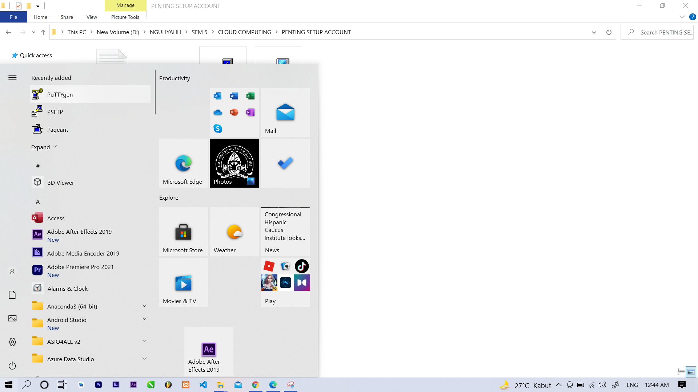
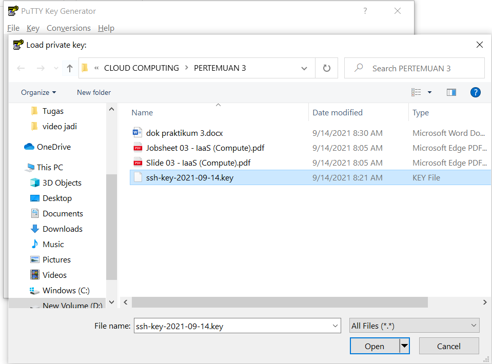
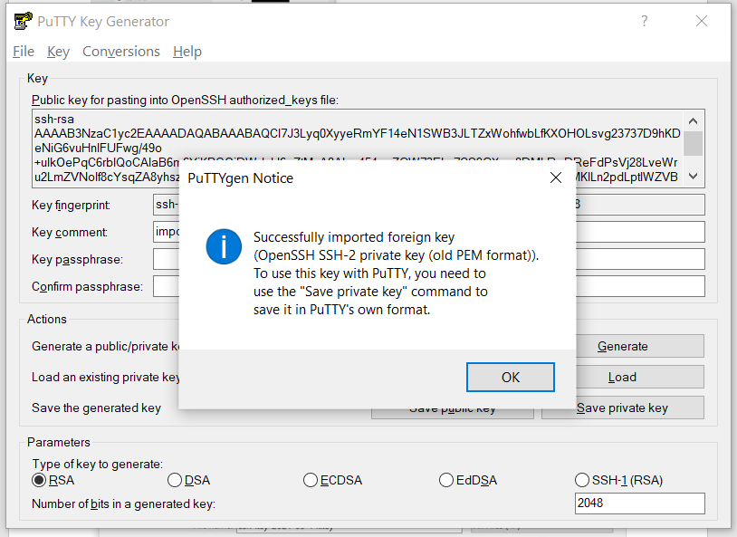
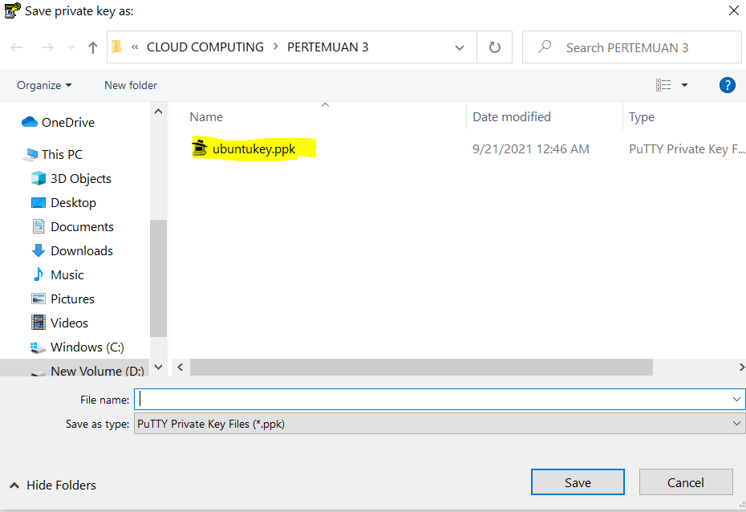
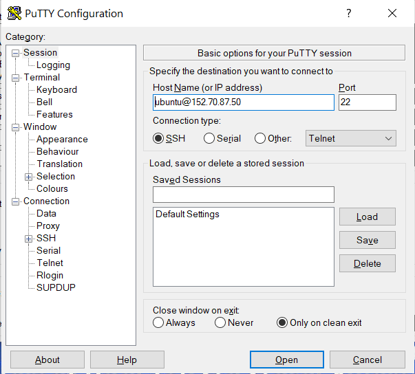
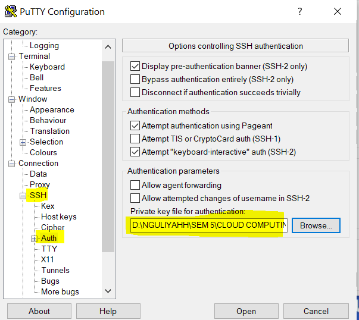
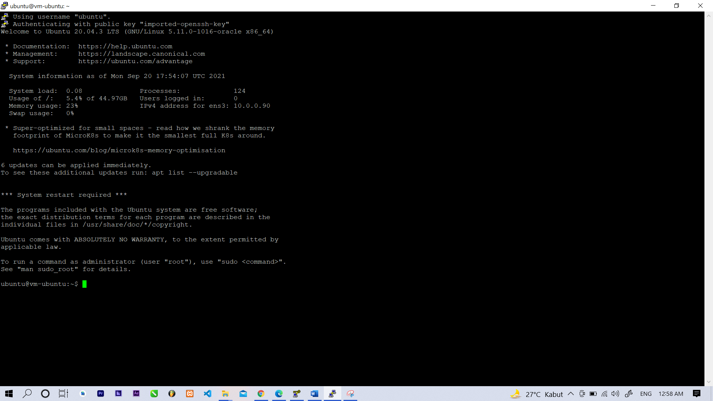

# 03 - Membuat Virtual Machine

## Tujuan Pembelajaran

1. Mengetahui layanan Oracle Cloud Infrastructure Compute
2. Mampu membuat Virtual Machine (VM) di layanan compute Oracle Cloud

## Hasil Praktikum

Berikut ini adalah bukti telah berhasil membuat virtual machine

## Menyambungkan SSH Virtual Machine melalui private key

1. Mendownload Aplikasi PuTTy unutuk menyambungkan lalu RUN puTTYgen untuk menyambungkan private key dan ssh

2. Import Private Key yang sudah tersimpan didalam folder.

3. Berikut adalah tampilan apabila telah sukses memasukkan private Key

4. Lalu Save Private Key dari puTTYgen

5. Lalu Masuk ke puTTY Configuration untuk Hostname masukkan username dan ip addres virtual machine yang telah dibuat. untuk punya saya seperti ini

6. Pergi Ke Window SSH lalu pilih auth,
lalu masukkan private key dari puTTgen yang sudah tersimpan didalam folder. Apabila sudah klik open

7. sudah tersambung
