# 03 - BAB 7 - SaaS (Software as a Service)

## Tujuan Pembelajaran

1. Mengetahui layanan Oracle Cloud Infrasturcture Software as a Service.
2. Mampu mengguankan layanan software layanan oracle.

# Hasil Praktikum
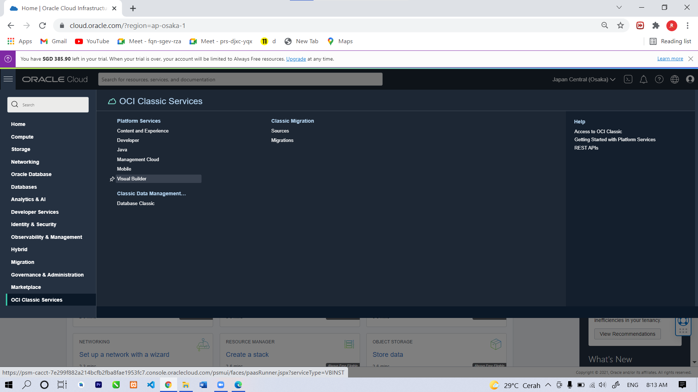
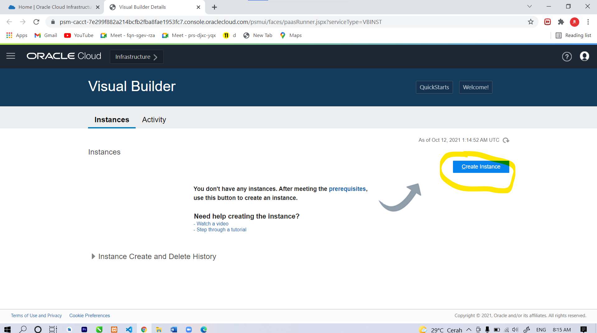
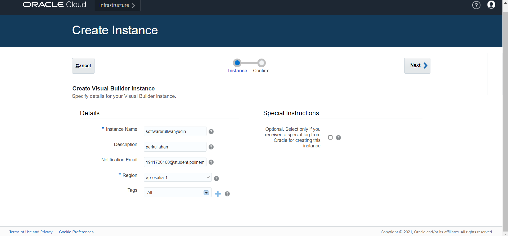
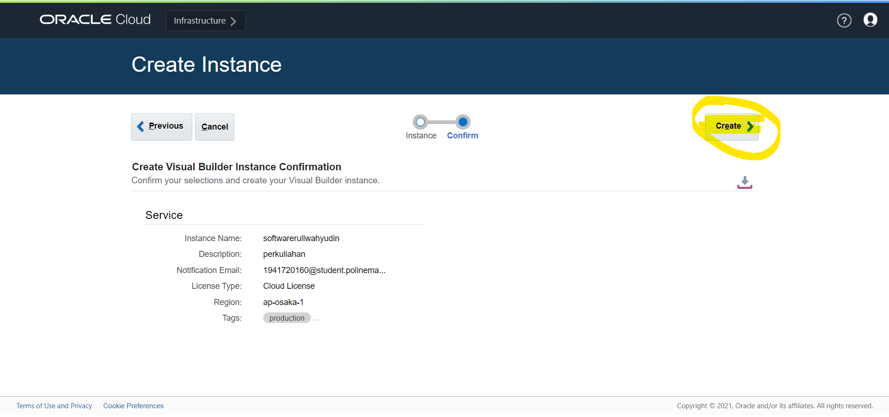

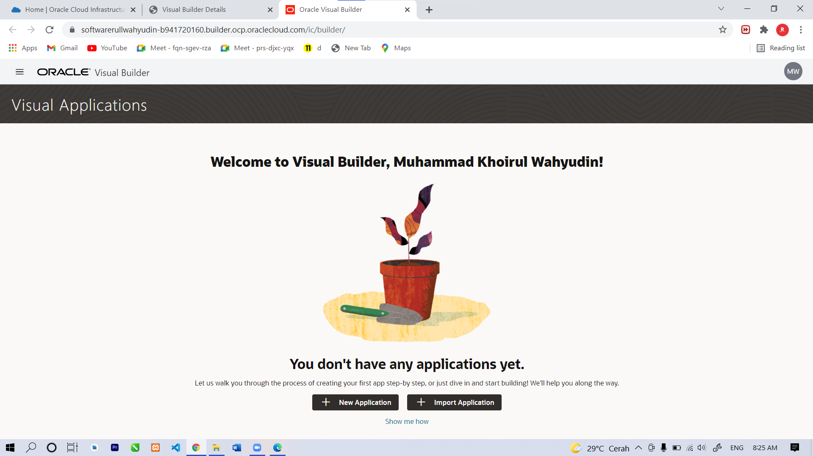
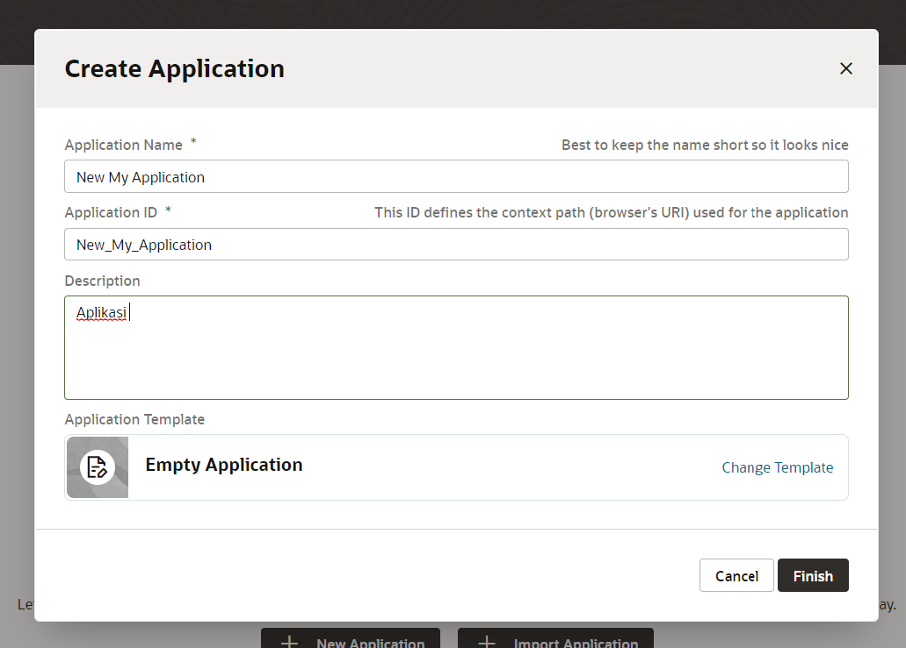
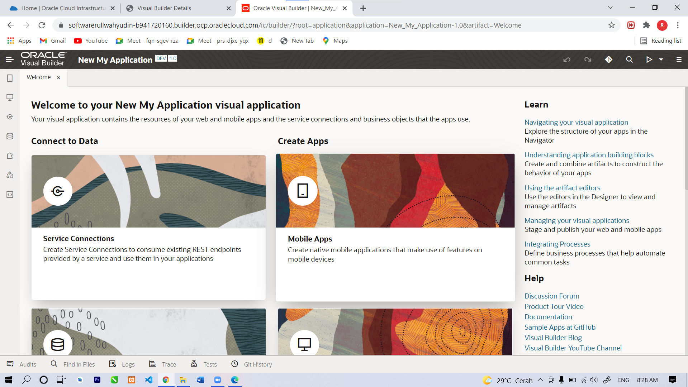
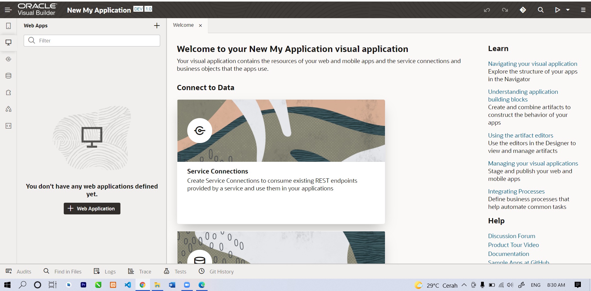
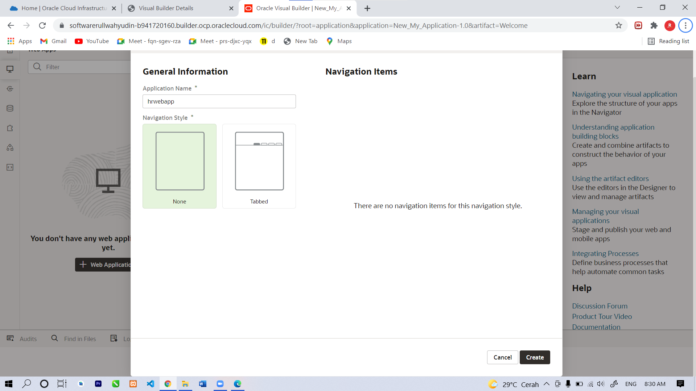
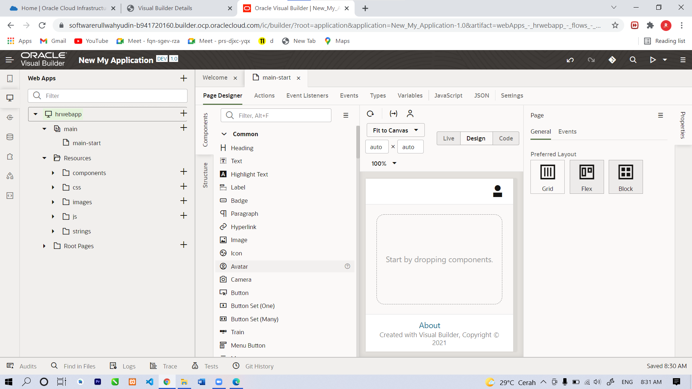
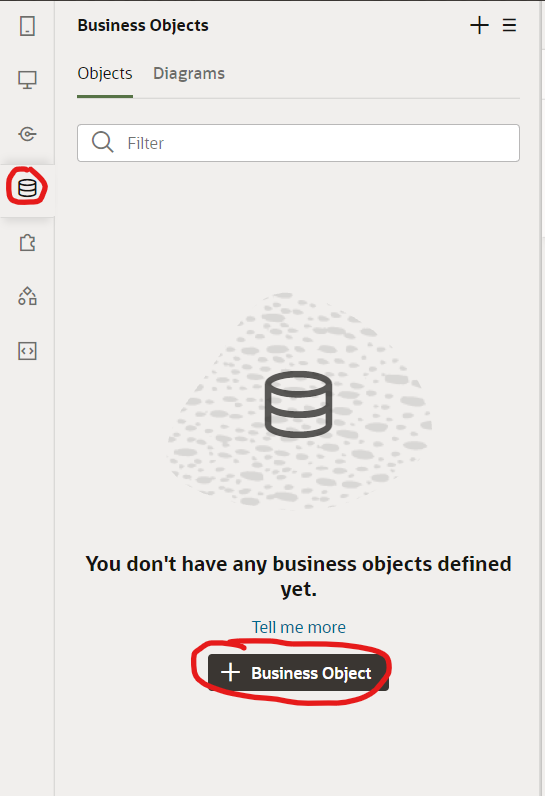
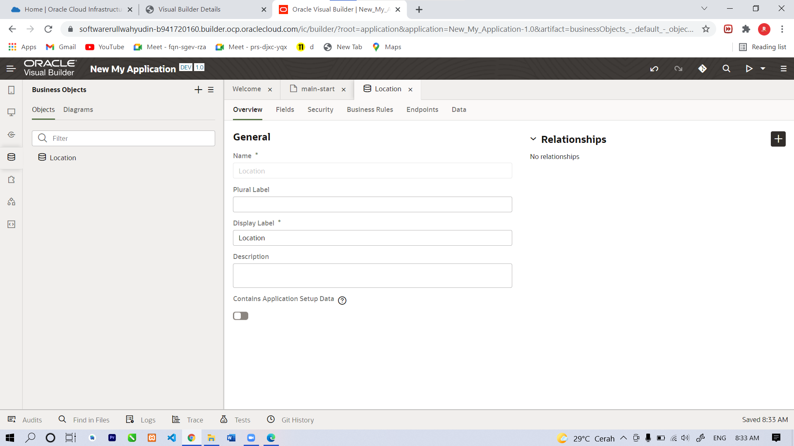
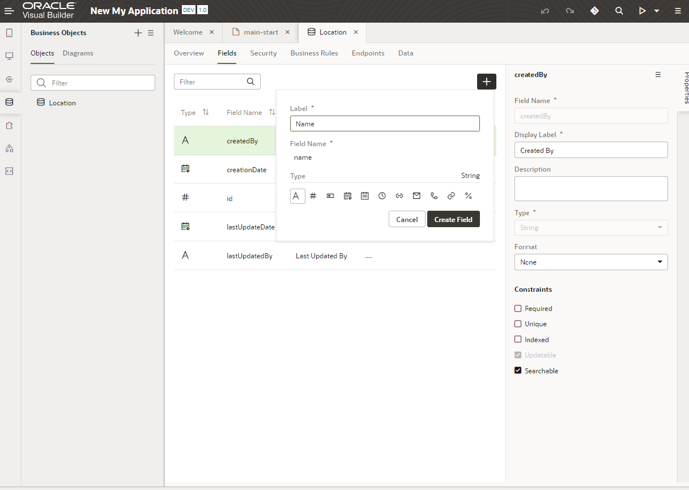
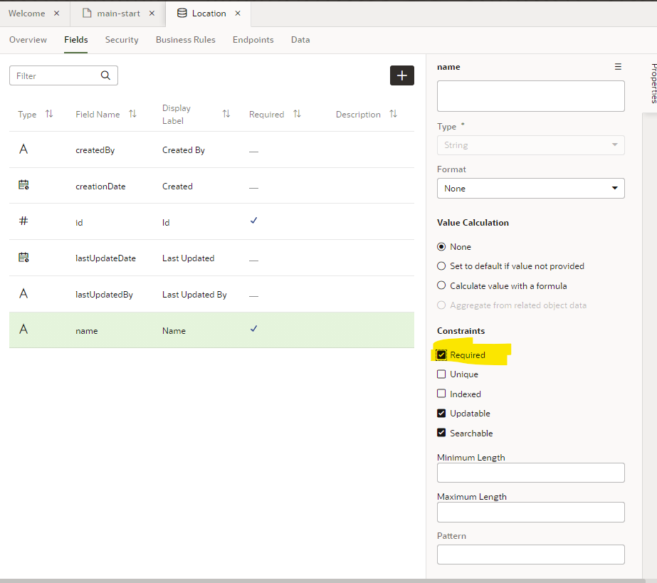
