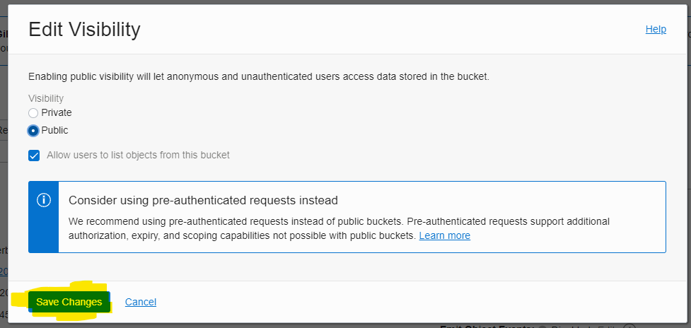

# 08 - Object Storage

## Tujuan Pembelajaran

1. Mengetahui Object Storage yang ditawarkan Oracle Cloud Infrastructure (OCI)
2. Dapat memanfaatkan layanan Object Storage yang ditawarkan Oracle Cloud Infrastructure (OCI)

# Hasil Praktikum

# Tugas
1. Carilah aplikasi web static kemudian upload ke Object Storage yang telah Anda buat.

# Hasil Praktikum

