# 08 - Object Storage

## Soal
Silakan masing-masing individu memanfaatkan object storage sebagai media penyimpanan assets
(gambar, file2 upload, dsb) berdasarkan project Kuis 1 kemarin yaitu aplikasi Wordpress.
Sehingga hasil akhir utk UTS aplikasi dpt memanfaatkan VM, DB instance dan Object Storage.
Buatlah laporan di masing-masing repo private GitHub Anda!
Deadline 2 Nov 2021 Jam 07:00 WIB.

# Hasil Praktikum
### Login Ke Akun Wordpress Masing Masing
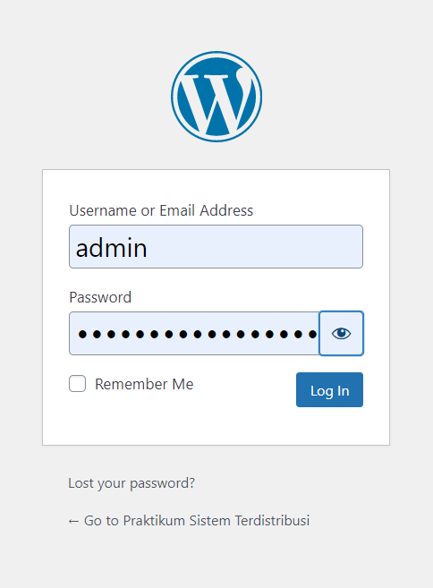

### Membuat Postingan Baru di Wordpress dengan klik New Post
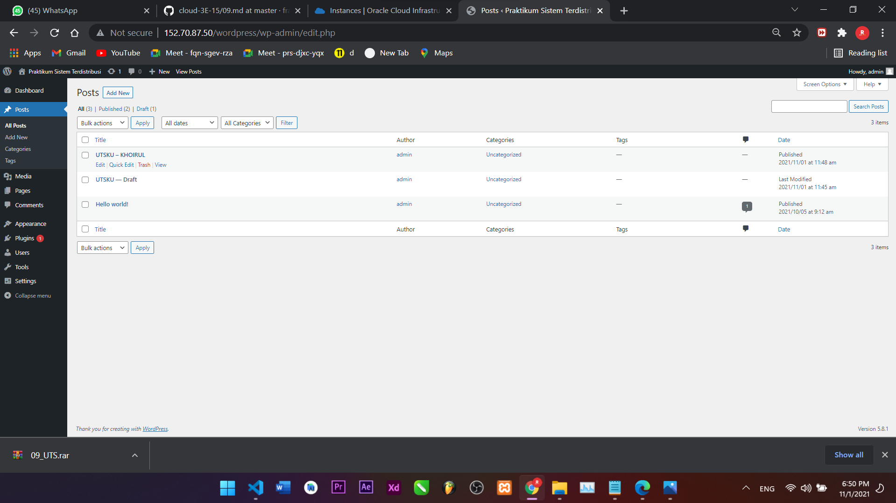
### Membuat Backet dan mengatur visibilitas menjadi public
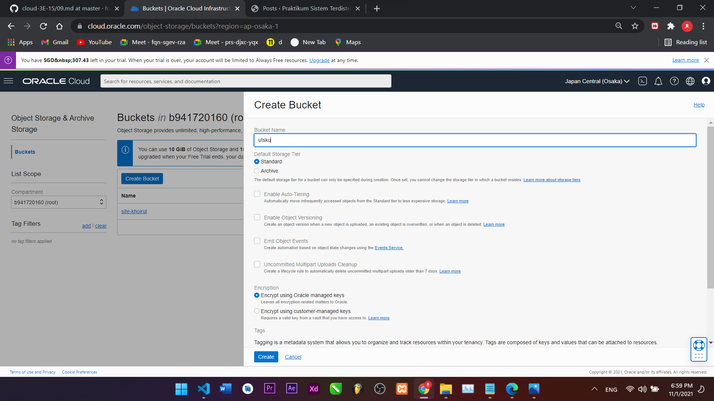
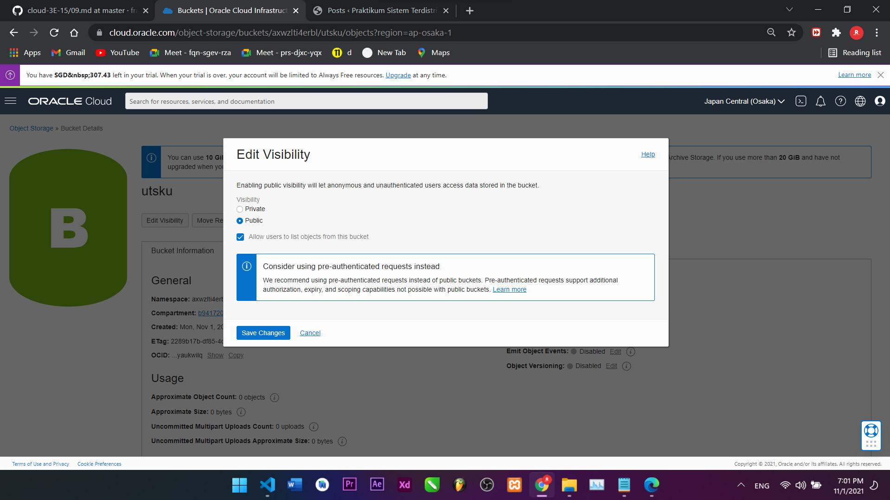
### Membuat Folder lalu mengupload file-file yang dibutuhkan.
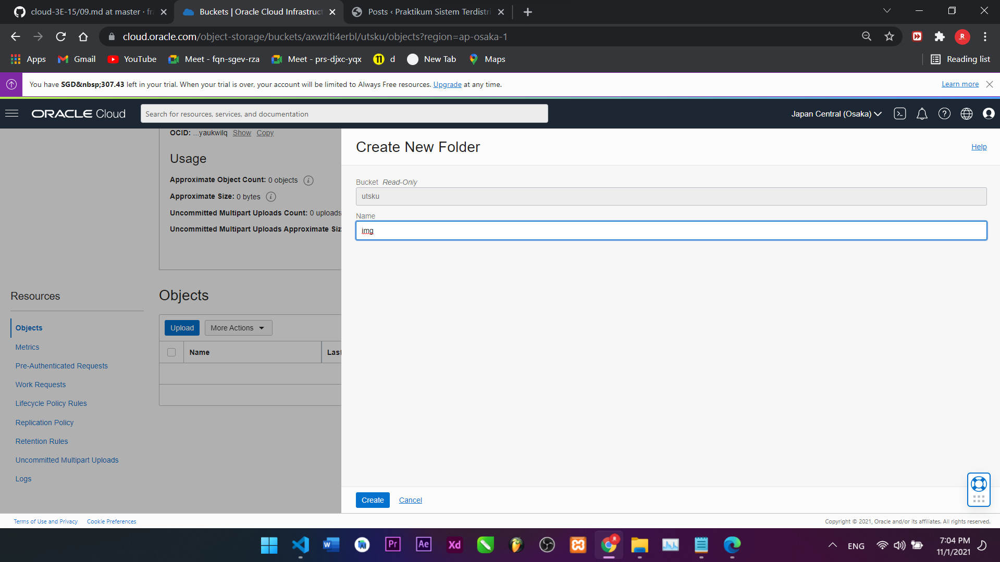
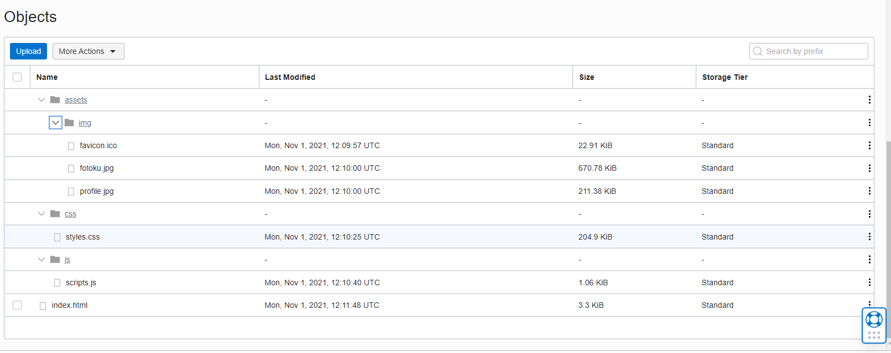
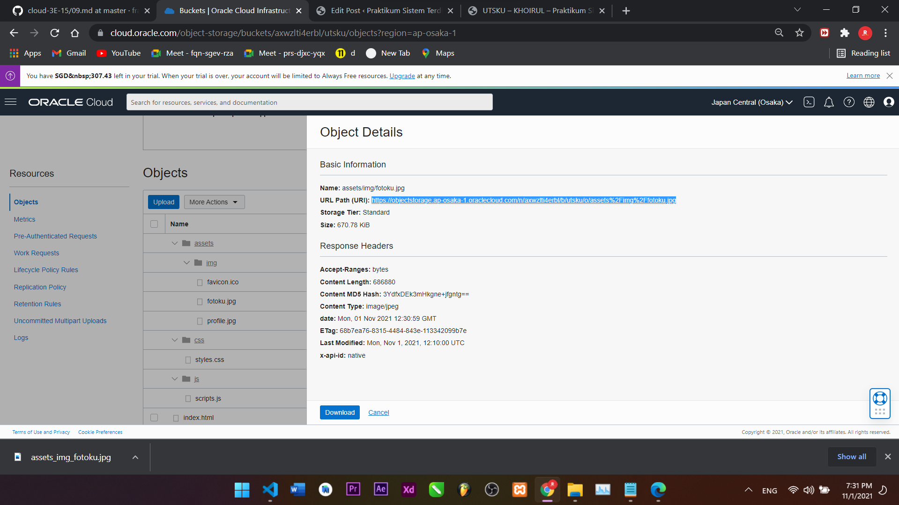
### Mengedit dan Copy Link Addres lalu masukkan link nya.
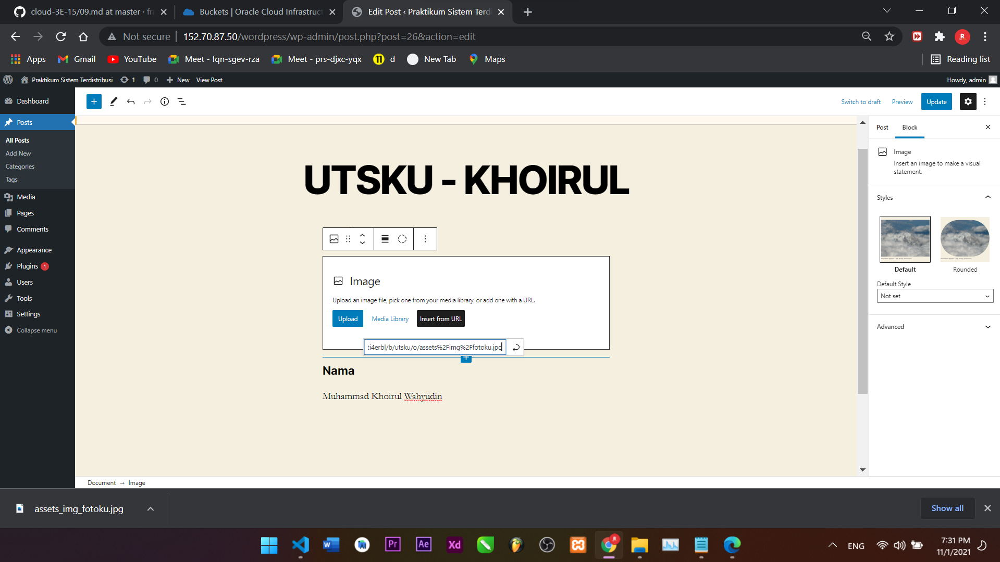
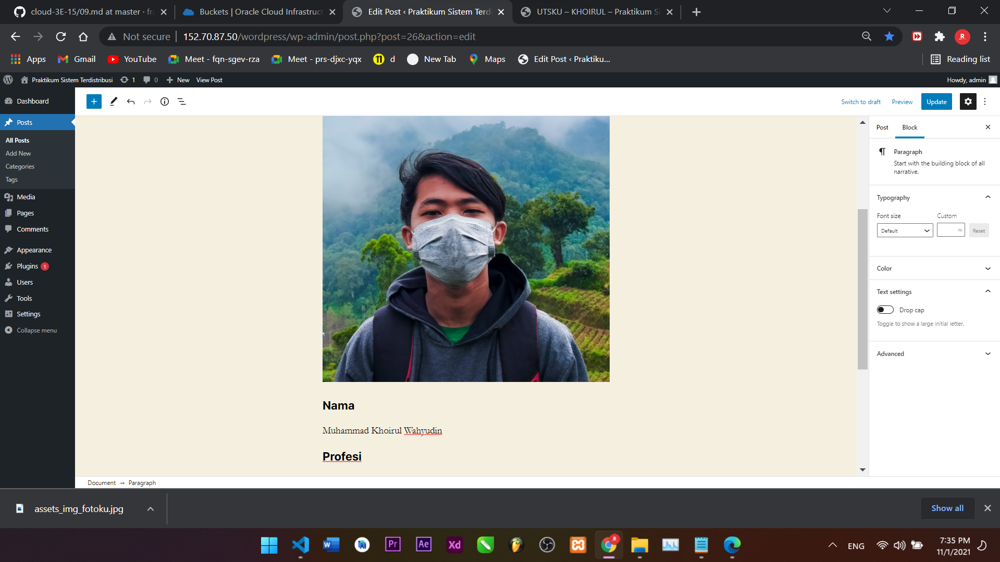
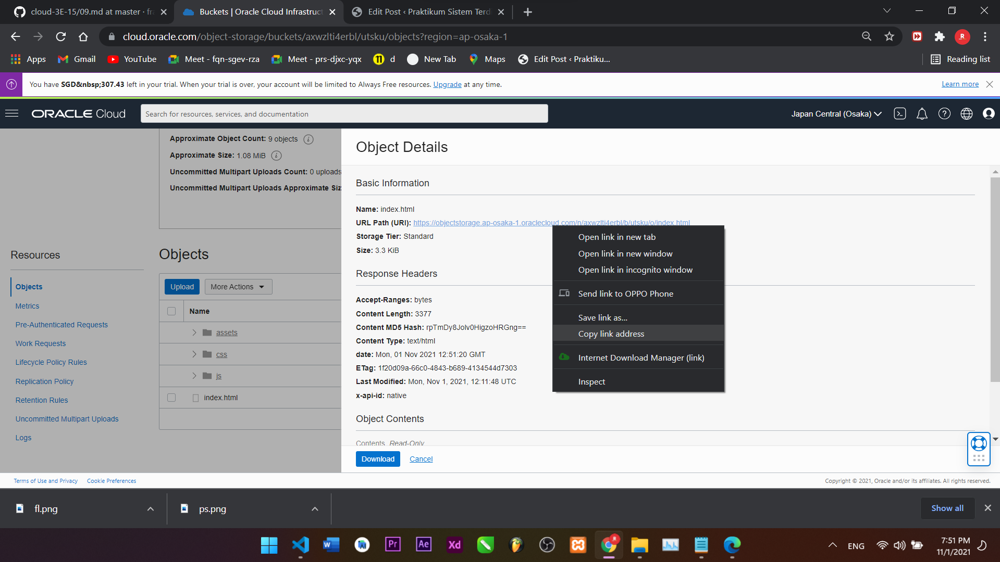
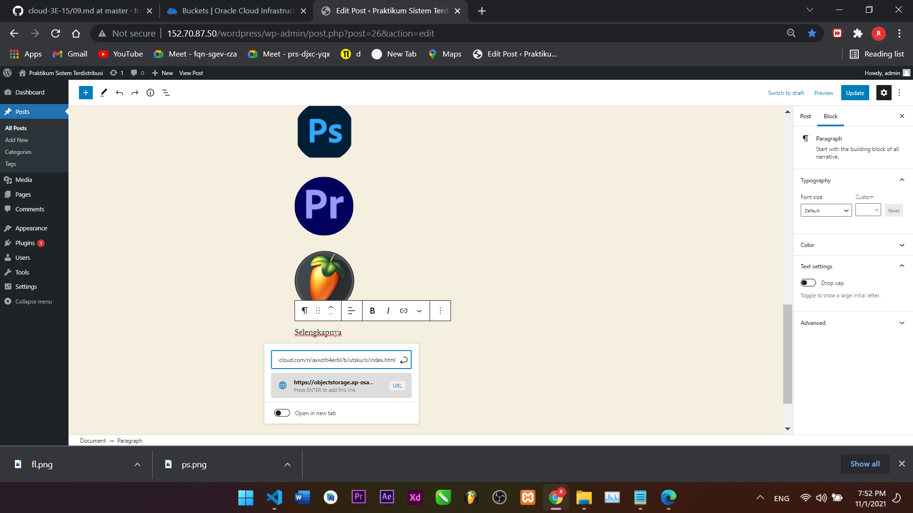

## PREVIEW
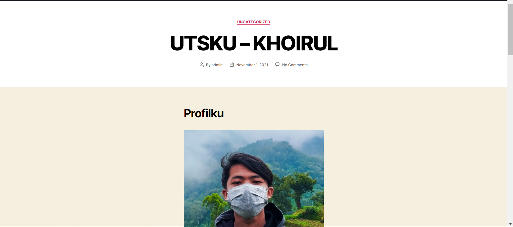
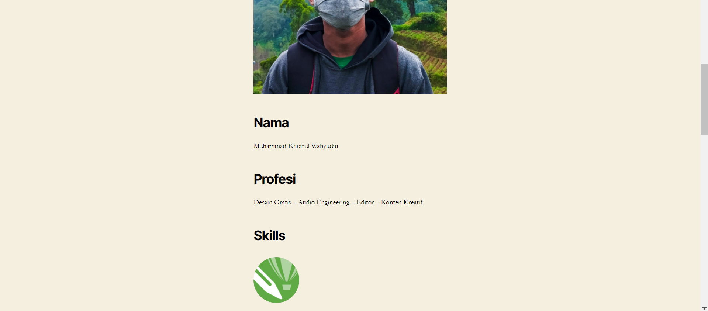
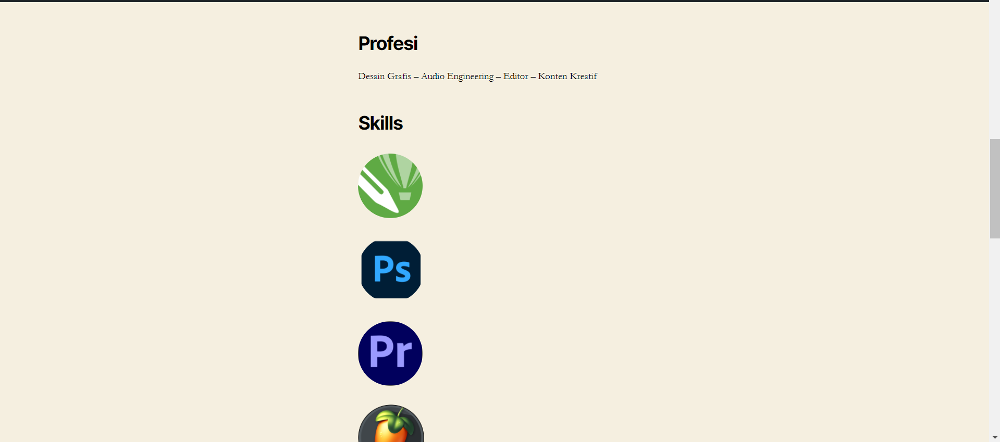
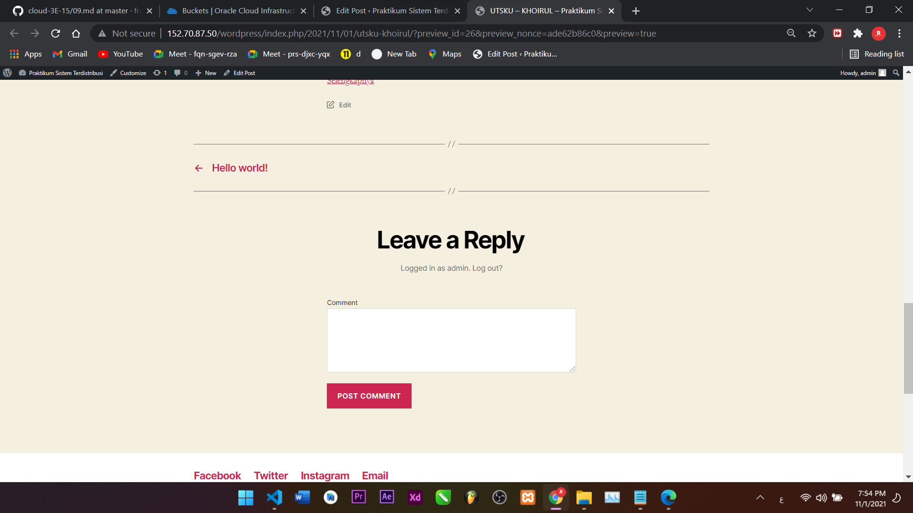

## LINK WORDPRESS
http://152.70.87.50/wordpress/index.php/2021/11/01/utsku-khoirul/