# 11. JOBSHEET 11 - DOCKER 2

## Praktikum
### Membuat dan Memeriksa Docker Network

### Menghubungkan Container ke Network

### 1.3 Membuka Port Container

### Docker Volume
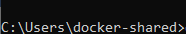
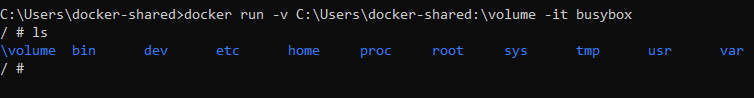
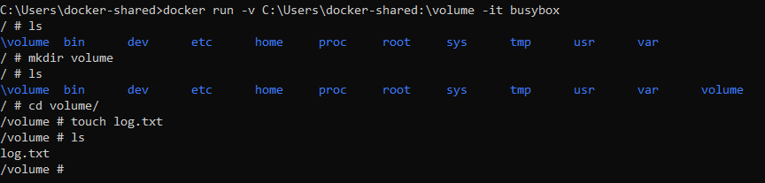

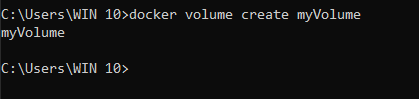
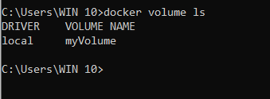
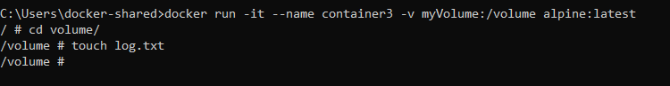
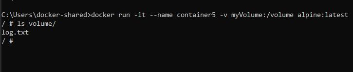

# 2.2 Menghapus Volume
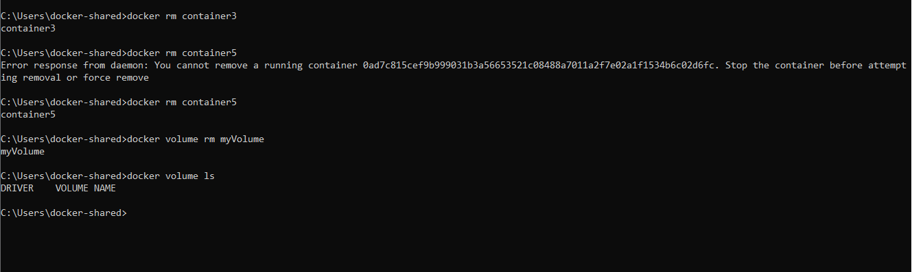
# Praktikum 3 : Docker Compose
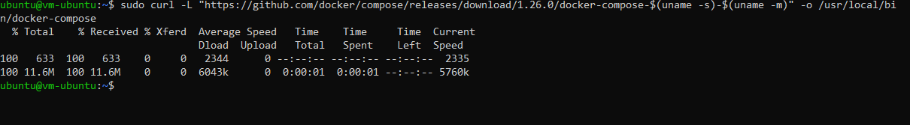
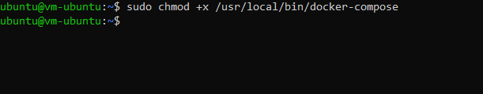
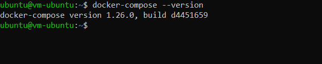
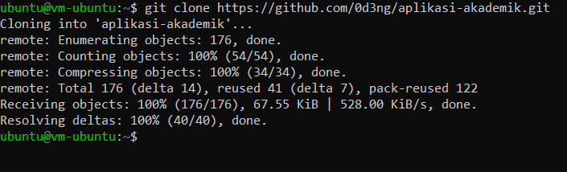
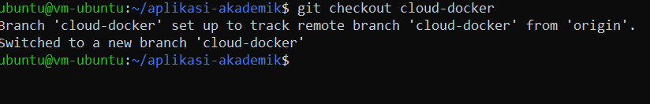
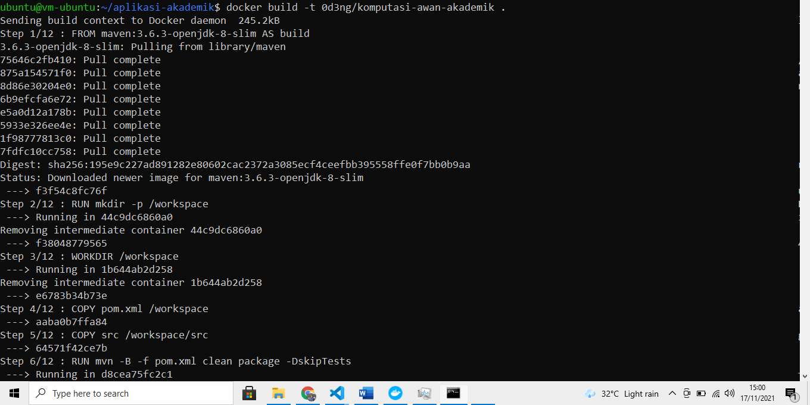
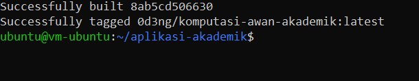
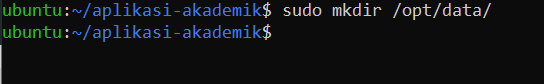

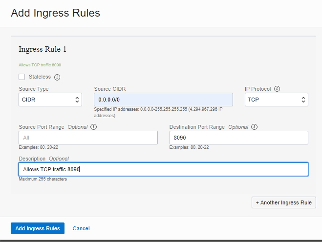
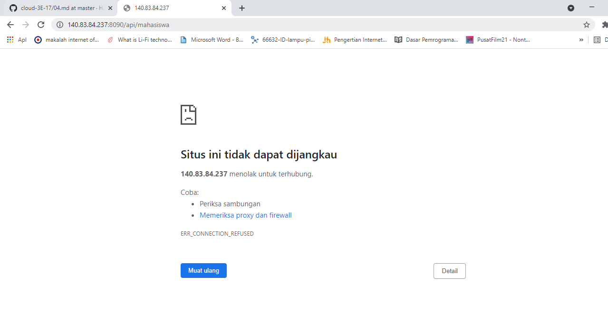
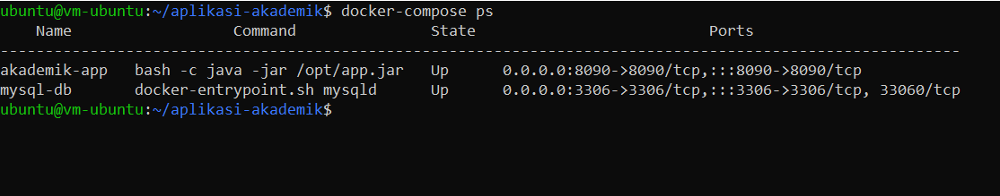
