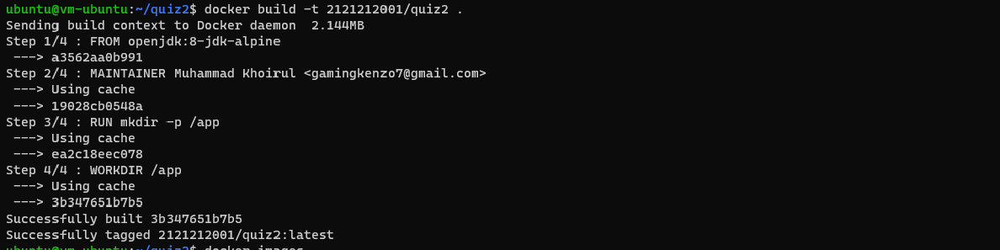
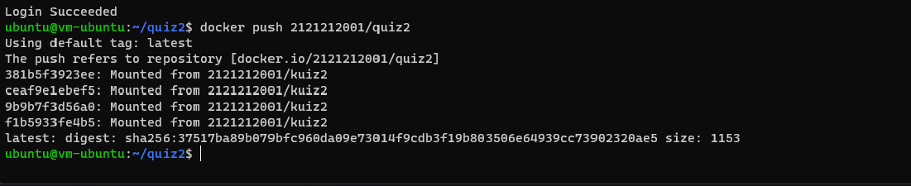

# PRAKTIKUM - KUIS DOCKER

## Praktikum
### Masuk VM.

### disini saya membuat folder baru didalam vm.
### setelah membuat folder baru saya clone repository file web statis yang akan saya gunuakan

### setelah melakukan clone yang saya lakukan selanjutnya adalah buid images

### mengecek images dengan perintah docker images

### push ke docker hub

### berhasil di push
