# PRAKTIKUM JOBSHEET 15 - AUTOSCALLING

## Praktikum
### Membuat Instance Configuration
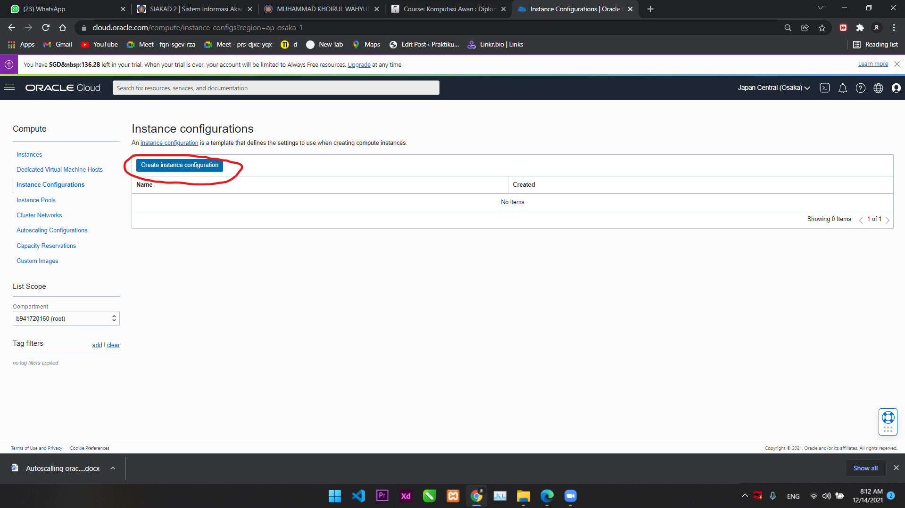
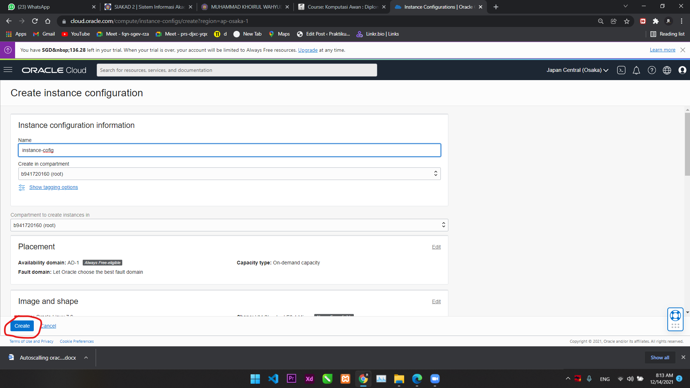
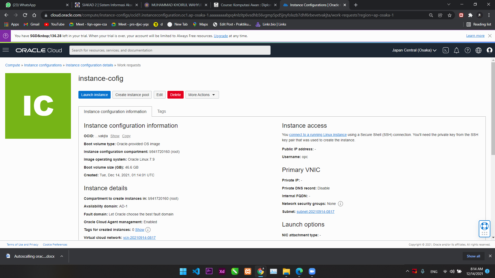

### Membuat Instance Pool
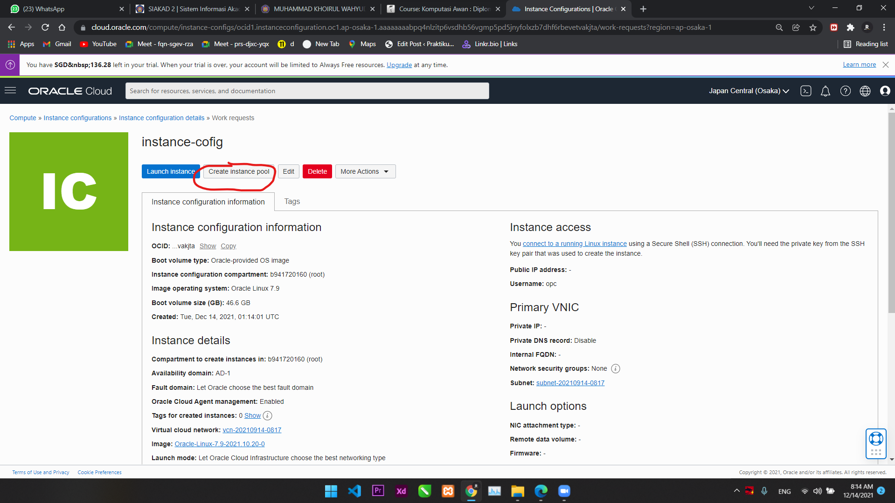
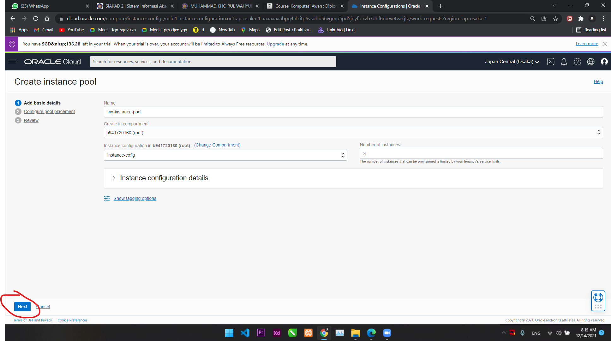
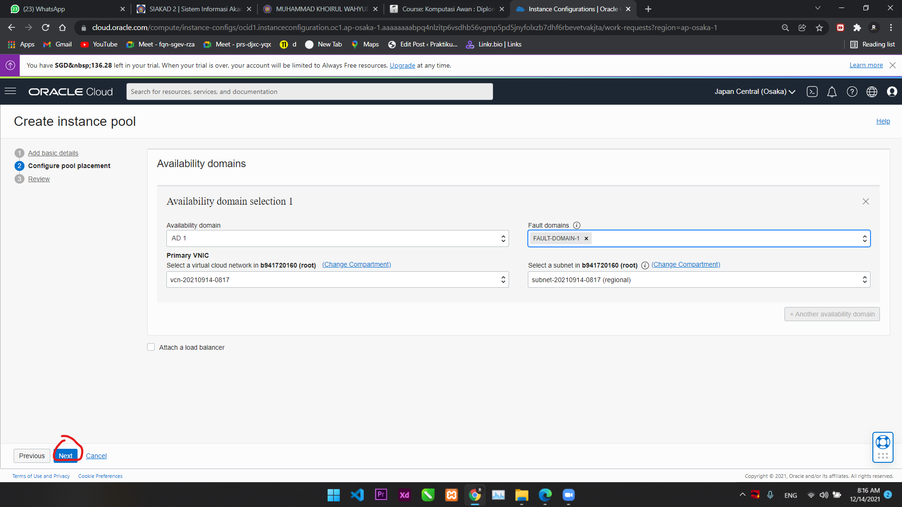
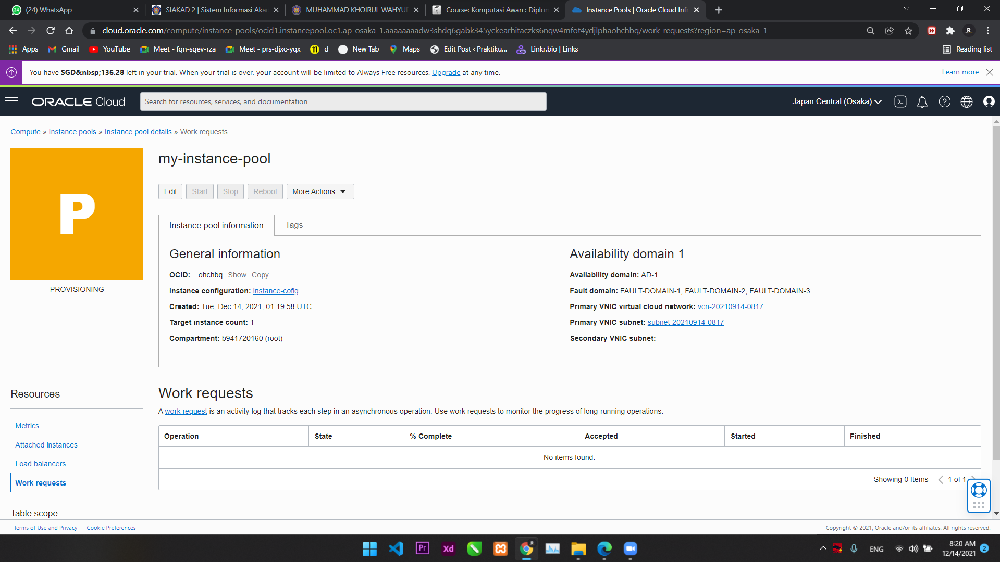

### Membuat Konfigurasi Autoscalling
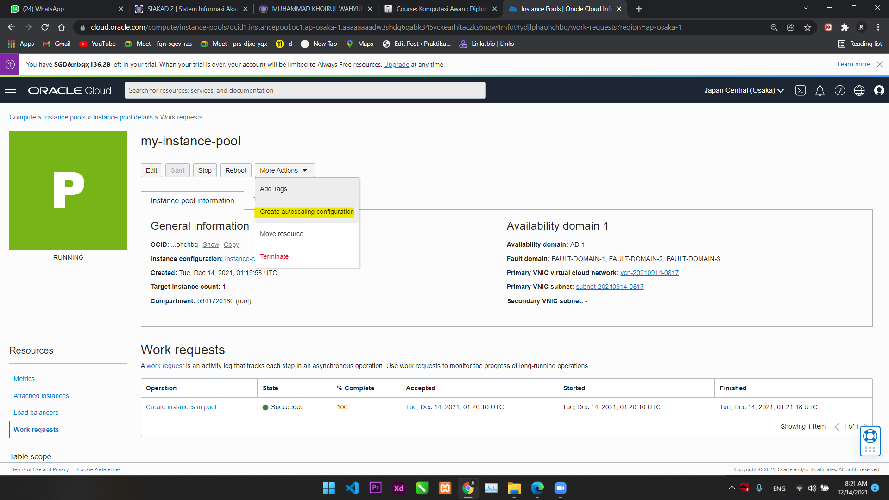
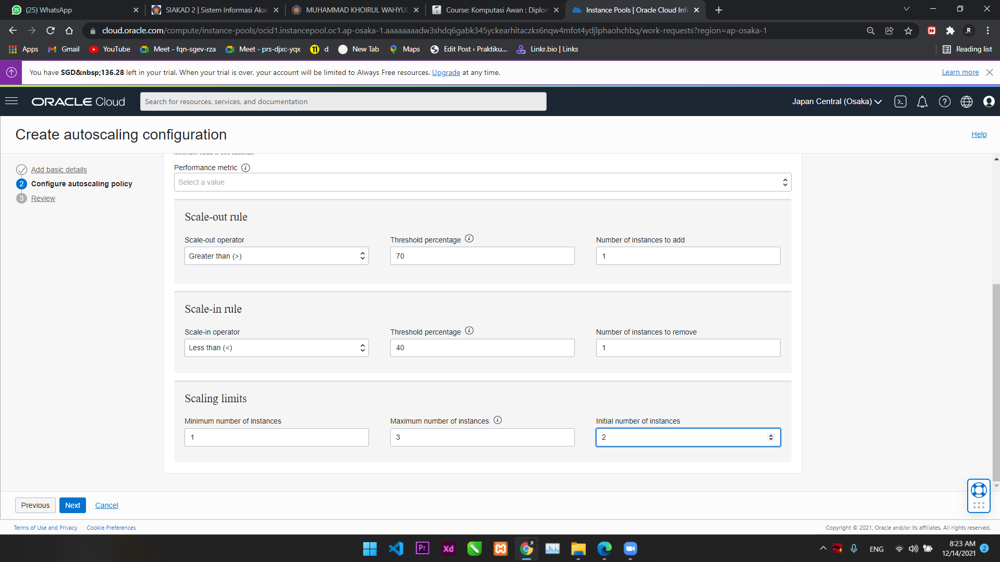
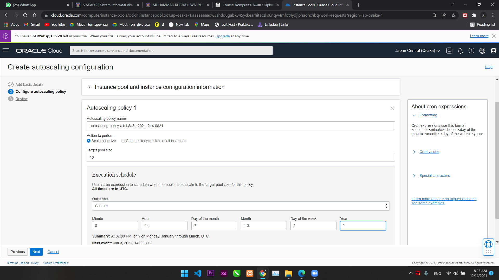
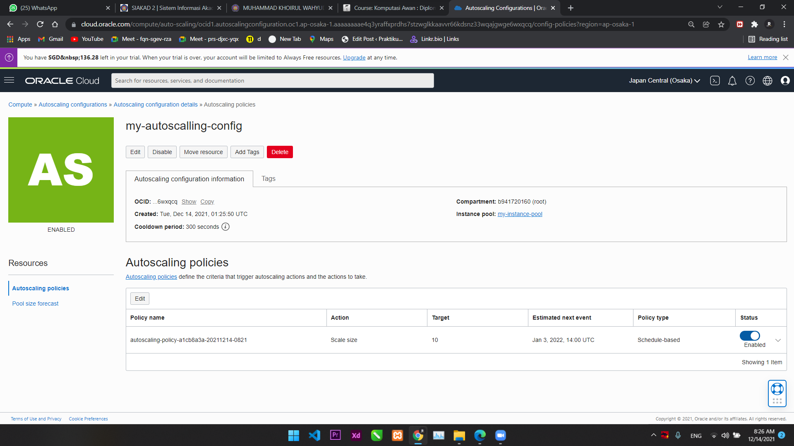

# TUGAS
## 1. Lakukan langkah-langkah di atas, dan buat laporan.
Laporan sudah tercantum diatas
## 2. Jelaskan Apa kaitan Autoscalling dengan Availability
Auto Scaling membantu Anda menjaga ketersediaan aplikasi dan memungkinkan Anda untuk secara otomatis menambah atau menghapus instans EC2 sesuai dengan ketentuan yang Anda tetapkan.
